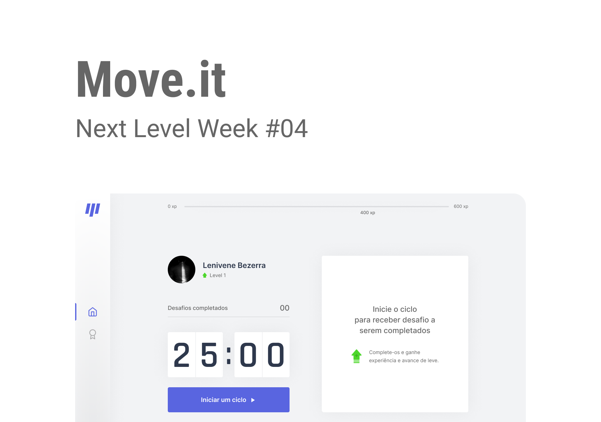

<div align="center">
    
    <br><br>
    <h1 style="border:0;font-weight:bold;text-transform:uppercase;margin:0">Move.it</h1>
    <b>💪 Be more productive and take care of your health.</b>  
    <br>
    <a href="./LICENSE.md">
        
    </a>
</div>

# 📔 Index

- [📔 Index](#-index)
- [📖 About](#-about)
- [🚀 Technologies](#-technologies)
- [📚 How to Use?](#-how-to-use)
  - [1 - Clone repository](#1---clone-repository)
  - [2 - Installing the packages](#2---installing-the-packages)
  - [3 - Starting server](#3---starting-server)
- [Acknowledgment](#acknowledgment)
- [📝 License](#-license)

# 📖 About

The _Move.it_ This a application for what be more productive and take care of your health.

# 🚀 Technologies

I developed using the following technologies

- [TypeScript](https://www.typescriptlang.org/)
- [Node.js](https://nodejs.org/en/)
- [Next.js](https://nextjs.org/)
- [VSCode](https://code.visualstudio.com/)
- [Styled Components](https://styled-components.com/)

# 📚 How to Use?

- To use, you need some things
  - Terminal
  - Have the [Node.js](https://nodejs.org/en/download/) in a stable version
  - You need a package manager. I recommend [Yarn](https://classic.yarnpkg.com/pt-BR/docs/install/), but you can use [NPM](https://www.npmjs.com/).

## 1 - Clone repository

Use this command

```sh
git clone git@github.com:lenivene/moveit.git
```

## 2 - Installing the packages

Open your terminal in folder: `moveit`, and use the line command:

```sh
yarn install #or
npm install
```

## 3 - Starting server

```sh
yarn dev
# or
yarn build #and
yarn start
```

# Acknowledgment

> Thanks [Diego](https://github.com/diego3g), for this event/lessons, #missionComplete and #challengeAccepted

# 📝 License

This project is under the MIT license.
